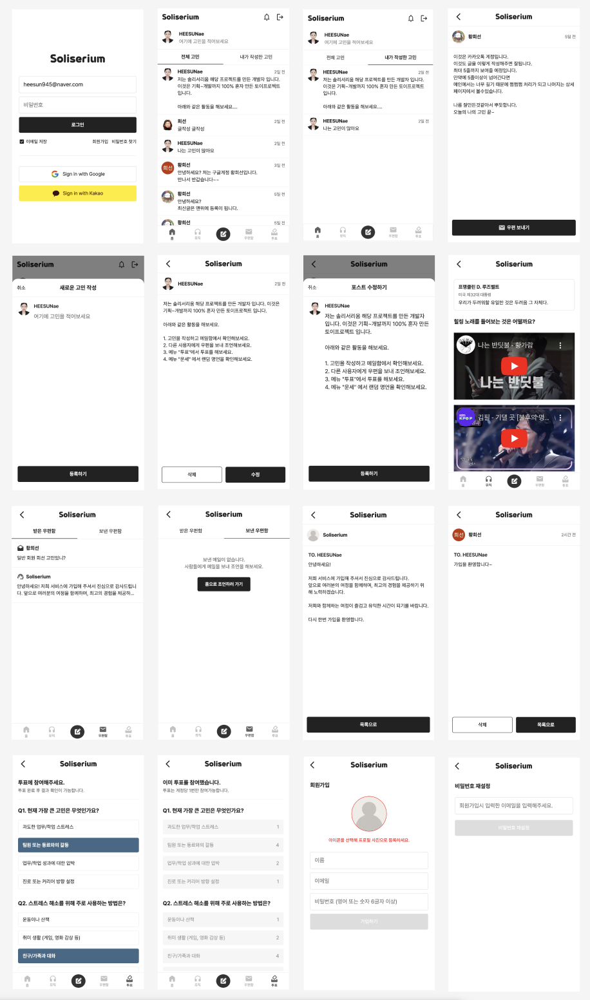

## Soliserium

```
"Solace(위로)"와 "Cerium(공간)"의 조합으로, 위로와 안식을 주는 공간이라는 뜻으로 고민상담을 주고받는 웹앱입니다.
현재 기획부터 개발까지 혼자 토이 프로젝트로 작업중입니다.
```



### 개발내용

- **로그인**
  - 회원가입 후 이메일이 인증된 사용자만 로그인이 가능합니다.
  - '이메일 저장'을 통해 자주 로그인하는 이메일을 저장할 수 있습니다.
  - SNS 소셜로그인 (Google, Kakao) 로그인이 가능합니다.
- **회원가입**
  - 서비스 사용시 타인에게 보여질 프로필 이미지를 업로드 합니다.
  - 이름은 영어, 한글, 띄어쓰기를 포함하여 작성해야합니다.
  - 이메일은 로그인, 비밀번호 재설정시 사용되며 이메일 형식이여야 합니다.
  - 비밀번호는 영어, 한글을 포함하여 6글자 이상이여 합니다.
  - 필수인 값을 모두 입력하면 회원가입 버튼이 활성화됩니다.
  - 회원가입이 완료되면 입력한 이메일로 인증 메일이 전송되며 받은 메일함 확인 후 로그인이 가능합니다.
- **비밀번호 변경**
  - 본인인증을 하기 위해 가입시 인증받은 이메일 주소를 입력하면 비밀번호 재설정 메일이 전송되며 비밀번호 변경이 가능합니다.
- **홈화면**
  - 로그인에 성공하면 홈화면으로 이동하며 사람들이 작성한 포스트를 확인할 수 있습니다.
  - 하단 네비게이션의 '작성' 버튼 혹은 상단 '자신의 프로필' 부분을 클릭하면 포스트를 작성할 수 있는 바텀시트가 나타나며 포스트를 작성할 수 있습니다.
- **홈화면**
  - 모든 사용자가 작성한 전체 포스트와 내가 작성한 포스트를 확인할 수 있습니다. (5줄까지만 노출)
  - 하단 중앙에 있는 작성 메뉴와 상단 프로필 부분을 클릭하면 새로운 포스트를 작성할 수 있습니다.
  - 포스트 리스트를 클릭하면 상세페이지로 이동합니다.
- **포스트 상세**
  - 해당 포스트에 대한 내용을 볼 수 있으며 하단에 본인이 작성한 포스트라면 **수정**, **삭제** 버튼이 표출되고 다른 유저가 작성한 포스트일 경우에는 **메일 보내기** 버튼이 표출됩니다.
- **메일함**
  - 다른 사용자로부터 조언을 받은 내용을 받은 메일함에서 확인할 수 있습니다.
  - 다른 사용자에게 조언을 보낸 내용을 보낸메일함에서 확인할 수 있습니다.
  - 메일함에서 메일을 삭제할 수 있습니다.

### 기술스택

**Langauge** : HTML, CSS, TypeScript  
**Framework** : Next.js  
**DB** : Firebase, Cloudinary

:memo: **package.json**

| 이름                | 버전     |
| :------------------ | :------- |
| @react-oauth/google | ^0.12.1  |
| jwt-decode          | ^4.0.0   |
| axios               | ^1.7.9   |
| firebase            | ^11.0.2  |
| zustand             | ^5.0.2   |
| motion              | ^11.15.0 |
| dayjs               | ^1.11.13 |
